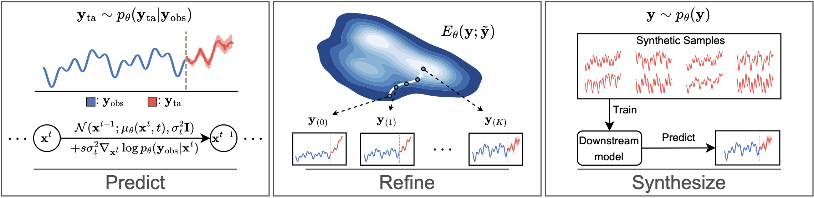
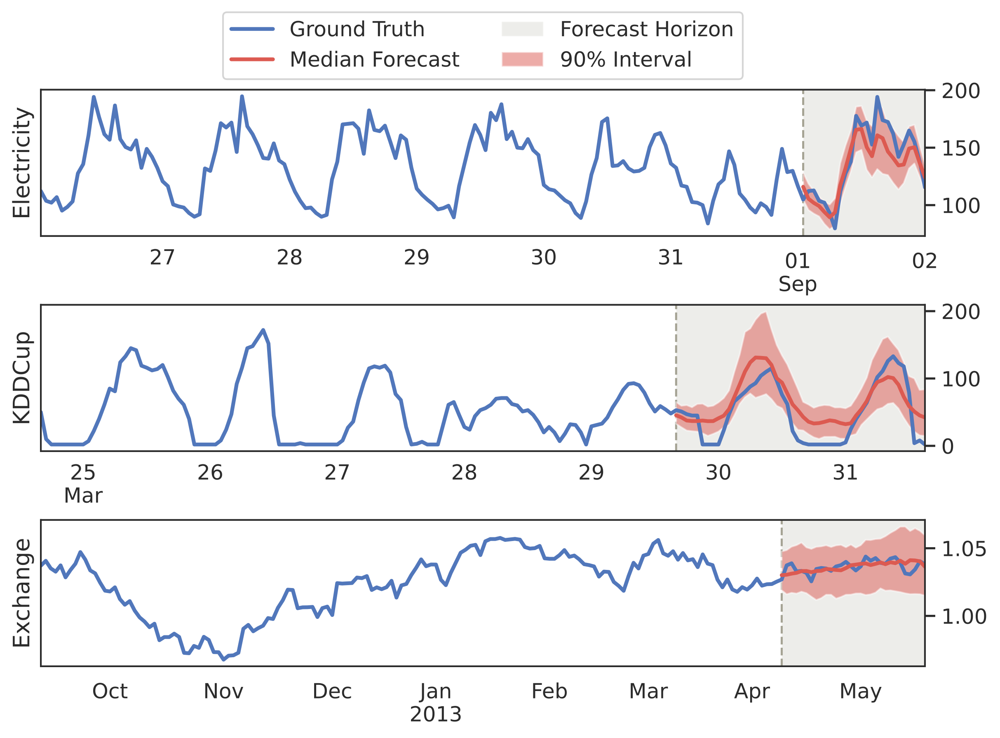

# TSDiff: An Unconditional Diffusion Model for Time Series

[](https://arxiv.org/abs/2307.11494)
[](https://opensource.org/licenses/Apache-2.0)
[](https://neurips.cc/)
<p align="center">
  
  <br />
  <span>Fig. 1: An overview of TSDiff’s use cases. <b>Predict:</b> By utilizing observation self-guidance, TSDiff can be
conditioned during inference to perform predictive tasks such as forecasting. <b>Refine:</b> Predictions
of base forecasters can be improved by leveraging the implicit probability density of TSDiff.
<b>Synthesize:</b> Realistic samples generated by TSDiff can be used to train downstream forecasters achieving good
performance on real test data.</span>
</p>

---

This repository contains the official implementation of the NeurIPS 2023 paper [*Predict, Refine, Synthesize: Self-Guiding Diffusion Models for Probabilistic Time Series Forecasting*](https://arxiv.org/abs/2307.11494). In this paper, we propose *TSDiff*, an unconditional diffusion model for time series. Our proposed self-guidance mechanism enables conditioning TSDiff for downstream tasks during inference, without requiring auxiliary networks or altering the training procedure. Furthermore, our refinement scheme leverages the implicit density learned by the diffusion model to iteratively refine the predictions of base forecasters. Finally, we demonstrate the high quality of the synthetic time series by training downstrain models solely on generated data and introducing the *Linear Predictive Score (LPS)*.

<p align="center">
  
  <br />
  <span>Fig. 2: Example forecasts generated by TSDiff-Q for
time series in Electricity, KDDCup, and Exchange — three datasets with different frequencies and/or prediction lengths.</span>
</p>

## Installation

TSDiff requires Python 3.8 or higher.

* Create a conda environment (optional, but recommended).
```sh
conda create --name tsdiff --yes python=3.8 && conda activate tsdiff
```
* Install this package.
```sh
pip install --editable "."
```

> [!TIP]  
> We have some updates in the `update` branch. If you're interested in testing out TSDiff or [training it on a custom dataset](https://github.com/amazon-science/unconditional-time-series-diffusion/issues/7), using the `update` branch maybe faster for training.

## Usage

### Training Models

Train models using the `train_model.py` and `train_cond_model.py` scripts for `TSDiff` and `TSDiff-Cond`, respectively. Sample configurations can be found in `configs/train_tsdiff.yaml` and `configs/train_tsdiff-cond.yaml`. Specific configurations used in the paper can be found in `configs/train_tsdiff` and `configs/train_tsdiff-cond`.

Example commands for regular (i.e., no missing values) forecasting:
```sh
# Train TSDiff on the Uber dataset for regular forecasting
python bin/train_model.py -c configs/train_tsdiff/train_uber_tlc.yaml

# Train TSDiff on the M4 dataset for regular forecasting
python bin/train_model.py -c configs/train_tsdiff/train_m4.yaml

# Train TSDiff-Cond on the Uber dataset for regular forecasting
python bin/train_cond_model.py -c configs/train_tsdiff-cond/uber_tlc_hourly.yaml

# Train TSDiff-Cond on the M4 dataset for regular forecasting
python bin/train_cond_model.py -c configs/train_tsdiff-cond/m4_hourly.yaml
```

Example commands for forecasting with missing values:
```sh
# Train TSDiff on the Uber dataset for the missing values experiment
python bin/train_model.py -c configs/train_tsdiff/train_missing_uber_tlc.yaml

# Train TSDiff on the KDDCup dataset for the missing values experiment
python bin/train_model.py -c configs/train_tsdiff/train_missing_kdd_cup.yaml

# Train TSDiff-Cond on the Uber dataset for the RM missing values experiment
python bin/train_cond_model.py -c configs/train_tsdiff-cond/missing_RM_uber_tlc_hourly.yaml

# Train TSDiff-Cond on the KDDCup dataset for the BM-B missing values experiment
python bin/train_cond_model.py -c configs/train_tsdiff-cond/missing_BM-B_kdd_cup_2018_without_missing.yaml

# Train TSDiff-Cond on the KDDCup dataset for the BM-E missing values experiment
python bin/train_cond_model.py -c configs/train_tsdiff-cond/missing_BM-E_kdd_cup_2018_without_missing.yaml
```
Note that for TSDiff we train only one model and all the missing value scenarios are evaluated using the same unconditional model. However, for TSDiff-Cond, one model is trained per missingness scenario.

### Evaluating Models
The unconditional models trained above can be used for the following tasks.

#### Predict using Observation Self-Guidance
Use the `guidance_experiment.py` script and `configs/guidance.yaml` config to run the forecasting experiments. Specific configurations used in the paper can be found in `configs/guidance/`.

Example commands:
```sh
# Run observation self-guidance on the Solar dataset
python bin/guidance_experiment.py -c configs/guidance/guidance_solar.yaml --ckpt /path/to/ckpt

# Run observation self-guidance on the KDDCup dataset
python bin/guidance_experiment.py -c configs/guidance/guidance_kdd_cup.yaml --ckpt /path/to/ckpt
```

#### Refine Predictions of Base Forecasters
Use `refinement_experiment.py` script and `configs/refinement.yaml` config to run the refinement experiments. Specific configurations used in the paper can be found in `configs/refinement/`.

Example commands:
```sh
# Refine predictions from the Linear model on the Solar dataset
python bin/refinement_experiment.py -c configs/refinement/solar_nips-linear.yaml --ckpt /path/to/ckpt

# Refine predictions from the DeepAR model on the M4 dataset
python bin/refinement_experiment.py -c configs/refinement/m4_hourly-deepar.yaml --ckpt /path/to/ckpt
```
#### Train Downstream Models using Synthetic Data
Use `tstr_experiment.py` script and `configs/tstr.yaml` config to run the _train on synthetic-test on real_ experiments. Specific configurations used in the paper can be found in `configs/tstr/`.

Example commands:
```sh
# TSTR on the Solar Dataset
python bin/tstr_experiment.py -c configs/tstr/solar_nips.yaml --ckpt /path/to/ckpt

# TSTR on the KDDCup Dataset
python bin/tstr_experiment.py -c configs/tstr/kdd_cup_2018_without_missing.yaml --ckpt /path/to/ckpt
```

## BibTeX

If you find this repository or the ideas presented in our paper useful, please consider citing.

```
@inproceedings{kollovieh2023predict,
 author    = {Kollovieh, Marcel and Ansari, Abdul Fatir and Bohlke-Schneider, Michael and Zschiegner, Jasper and Wang, Hao and Wang, Yuyang},
 title     = {Predict, Refine, Synthesize: Self-Guiding Diffusion Models for Probabilistic Time Series Forecasting},
 booktitle = {Advances in Neural Information Processing Systems},
 year      = {2023}
}
```

## Security

See [CONTRIBUTING](CONTRIBUTING.md#security-issue-notifications) for more information.

## License

This project is licensed under the Apache-2.0 License.

